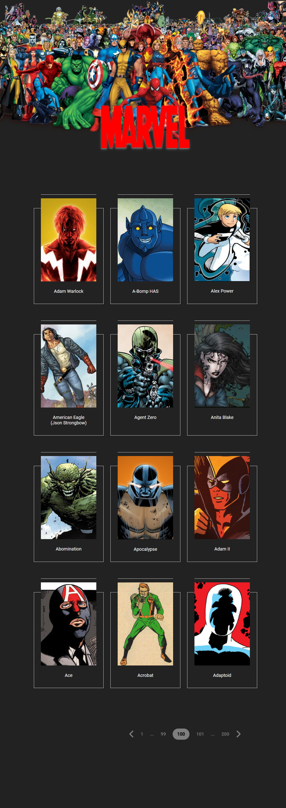
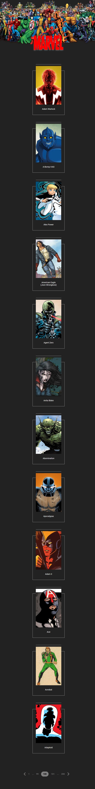

# Marvel CSS Project
You can find the live version of the application [here](https://react-bootcamp-week2-assignment.vercel.app/).

This project is a css work that I have done, showing marvel characters.

## Destop View

## Tablet View

## Mobile View

